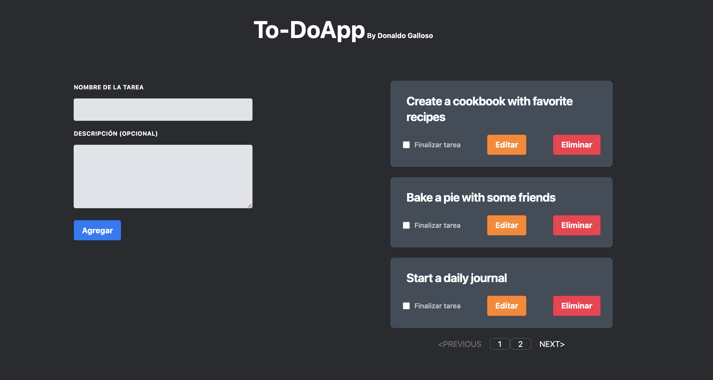

# Librerias y Herramientas Utilizadas

  1. [React.js](https://reactjs.org/).
  2. [Tailwindcss](https://tailwindcss.com/).
  3. [Sweetalert2](https://sweetalert2.github.io/).
  4. [Uuid](https://www.npmjs.com/package/uuid#uuidv1options-buffer-offset).
  5. [Animate.css](https://animate.style/).
  6. [React-paginate](https://www.npmjs.com/package/react-paginate).
  7. [DummyJSON](https://dummyjson.com/docs/todos).

# Demo de la aplicación

  ### [Demo To-DoApp](https://to-doappdonaldo.netlify.app/).
   

# Descarga (Clonar de repositorio)

1. git clone https://gitlab.com/learn577/practicas.git

2. cd practicas

2. cd react

3. cd todoapp

## Instalación

El proyecto fue creado con las sigueintes versiones
 * NodeJS : 18.13.0
 * React: 18.2.0
 * Tailwindcss: 3.2.7
 * Sweetalert2: 11.7.2
 * Uuid: 9.0.0
 * Animate.css: 4.1.1

### `npm i`

Instala todos los paquetes necesarios para el funcionamiento

### `npm start`

Inicia el proyecto en modo desarrollo, 
El proyecto se alojará por defecto en [http://localhost:3000](http://localhost:3000).

